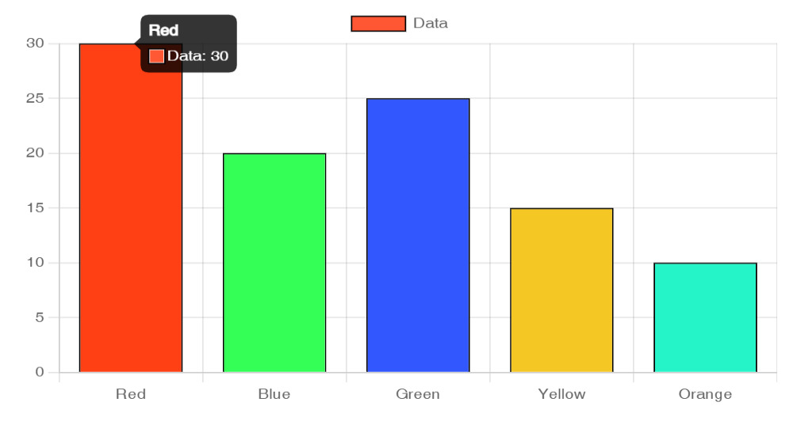

🟣 Dynamic Chart Generator

A user-friendly web application that allows users to create **interactive charts** dynamically. The app supports **Bar, Line, Pie, and Doughnut charts** using Chart.js.

## 📌 Features
✅ Create dynamic charts with custom data  
✅ Supports **Bar, Line, Pie, and Doughnut** charts  
✅ Visually appealing UI with smooth hover effects  
✅ Easy-to-use form for entering labels and values  
✅ **Fully responsive** design  

## 🛠️ Technologies Used
- **Frontend:** HTML, CSS, JavaScript  
- **Backend:** Node.js, Express.js  
- **Templating Engine:** EJS  
- **Chart Library:** Chart.js  

## 📥 Installation & Setup

Follow these steps to run this project on your local machine:

### 1️⃣ Clone the Repository  
```bash
git clone https://github.com/your-username/dynamic-chart-generator.git
cd dynamic-chart-generator
```

### 2️⃣ Install Dependencies  
```bash
npm install
```

### 3️⃣ Run the Application  
```bash
npm start
```
By default, the app runs on **`http://localhost:3000`**.

## 📸 Preview  


## 📂 Project Structure
```
/dynamic-chart-generator
│── public/               # Static assets (CSS, images, client-side JS)
│── views/                # EJS templates
│── routes/               # Express routes
│── app.js             # Main server file
│── package.json          # Project dependencies
│── .gitignore            # Ignored files (e.g., node_modules)
│── README.md             # Documentation
```

## 📌 Usage Instructions
1. Open the web application in your browser.
2. Choose a chart type from the dropdown.
3. Enter labels and values (comma-separated).
4. Click **"Generate Chart"** to visualize the data.

## 📜 License  
This project is **open-source** and available under the **MIT License**.

## ✨ Contributions  
Contributions are welcome! Feel free to fork the repository, create a new branch, and submit a pull request.

🚀 **Enjoy creating stunning charts dynamically!**  
🔗 **GitHub Repository:** [Your Repository Link](https://github.com/your-username/dynamic-chart-generator)
